# 🎬 KekikStreamAPI

**Modern, self-hosted medya streaming platformu**  
Kendi yayın merkezinizi kurun, arkadaşlarınızla senkronize video izleyin! 🚀

---

## 🚦 Ne Sunar?

KekikStreamAPI, [KekikStream](https://github.com/keyiflerolsun/KekikStream) kütüphanesini web arayüzü, API ve proxy katmanı ile birleştirerek uçtan uca bir streaming deneyimi sağlar.

- 🎥 Çoklu kaynak desteği: Onlarca kaynaktan içerik arama ve izleme  
- 🎭 Watch Party: Gerçek zamanlı senkronize izleme  
- 🌐 Modern Web Arayüzü: Responsive, kullanıcı dostu UI  
- 🔌 RESTful API: Kolay entegrasyon  
- 🛡️ Proxy Streaming: CORS ve geo-restriction bypass  
- 🎬 yt-dlp entegrasyonu: YouTube ve 1000+ site desteği

---

## 🚀 Hızlı Başlangıç

> Gereksinimler: Docker (önerilen) veya Python 3.11+, `yt-dlp` ve tarayıcı.

### Docker ile Kurulum (Önerilen)

```bash
git clone https://github.com/keyiflerolsun/KekikStreamAPI.git
cd KekikStreamAPI
docker-compose up -d
```

👉 Tarayıcınızdan erişin: **http://127.0.0.1:3310**

### Manuel Kurulum

```bash
pip install -r requirements.txt
python basla.py
```

> `AYAR.yml` içindeki port ve proxy ayarlarını ihtiyacınıza göre güncelleyin.

---

## 🧭 Mimari ve Akış

```mermaid
graph TB
    Client[🌐 Client]
    
    subgraph KekikStreamAPI[🎬 KekikStreamAPI]
        FastAPI[⚡ FastAPI Core]
        Home[🏠 Web UI]
        API[🔌 API]
        WatchParty[🎭 Watch Party]
        WSS[📡 WebSocket]
        Proxy[🛡️ Proxy]
        YtDlp[🎬 yt-dlp]
    end
    
    subgraph External[🌍 External Sources]
        KekikStream[📚 KekikStream]
        MediaSources[🎥 Media Sources]
    end
    
    Client -->|HTTP/WS| FastAPI
    FastAPI --> Home
    FastAPI --> API
    FastAPI --> WatchParty
    FastAPI --> WSS
    FastAPI --> Proxy
    
    Home --> KekikStream
    Home --> Proxy
    
    API --> KekikStream

    WatchParty <--> WSS
    WatchParty --> Proxy
    WatchParty --> YtDlp

    YtDlp --> Proxy
    KekikStream --> MediaSources

    style KekikStreamAPI fill:#2b2a29,stroke:#ef7f1a,stroke-width:2px
    style External fill:#0087a3,stroke:#00a0c2,stroke-width:2px
```



---

## 🎯 Kullanım Senaryoları

### 🌐 Web Arayüzü

- Ana sayfa, arama, kategori filtreleme  
- Sinematik video oynatıcı  
- Mobil/desktop uyumlu tasarım

### 🔌 API Endpoints

| Endpoint                     | Açıklama            |
|------------------------------|---------------------|
| `/api/v1/health`             | API sağlık kontrolü |
| `/api/v1/get_plugin_names`   | Tüm eklenti listesi |
| `/api/v1/get_plugin`         | Eklenti detayları   |
| `/api/v1/search`             | İçerik arama        |
| `/api/v1/get_main_page`      | Kategori içerikleri |
| `/api/v1/load_item`          | İçerik detayları    |
| `/api/v1/load_links`         | Video bağlantıları  |
| `/api/v1/extract`            | Link extraction     |

### 🎭 Watch Party

Gerçek zamanlı senkronize video izleme:

**Kullanım:**  
```
http://127.0.0.1:3310/watch-party/{ROOM_ID}?url={VIDEO_URL}
```

**Özellikler:** ⚡ WebSocket tabanlı senkronizasyon • 🔄 Drift correction • 🛡️ Akıllı buffer • 💬 Canlı sohbet • 🎬 YouTube/Vimeo/HLS/MP4

**Parametreler:**
| Parametre      | Zorunlu   | Açıklama                    |
|---------------:|:---------:|:----------------------------|
| `url`          | ✅        | Video URL'si                |
| `title`        | ❌        | Video başlığı               |
| `user_agent`   | ❌        | Özel User-Agent             |
| `referer`      | ❌        | Özel Referer                |
| `subtitle`     | ❌        | Altyazı URL'si (.srt, .vtt) |

### 🛡️ Proxy Sistemi

- HLS manifest rewriting, segment caching  
- CORS bypass ve custom headers  
- yt-dlp ile geniş kaynak desteği

---

## 📖 API Örnekleri

```bash
# Eklenti listesi
curl http://127.0.0.1:3310/api/v1/get_plugin_names

# Arama
curl "http://127.0.0.1:3310/api/v1/search?plugin=Dizilla&query=vikings"

# İçerik detayları
curl "http://127.0.0.1:3310/api/v1/load_item?plugin=Dizilla&encoded_url=..."

# Video bağlantıları
curl "http://127.0.0.1:3310/api/v1/load_links?plugin=Dizilla&encoded_url=..."
```

**Response Formatı:**
```json
{
  "results": [
    {
      "title": "Vikings",
      "url": "...",
      "thumbnail": "...",
      "description": "..."
    }
  ]
}
```

---

## 🧩 Teknoloji Yığını

**Backend:** FastAPI • Uvicorn • WebSockets • httpx  
**Frontend:** Jinja2 • CSS/JS minification  
**Medya:** yt-dlp • KekikStream  
**Güvenlik:** CORS • HSTS • Security Headers

---

## 🛠️ Geliştirme ve Eklenti Geliştirme

### Proje Yapısı

```
KekikStreamAPI/
├── Core/              # FastAPI app
├── Public/
│   ├── Home/          # Web UI
│   ├── API/v1/        # RESTful API
│   ├── WatchParty/    # Watch Party
│   ├── WebSocket/     # WebSocket
│   └── Proxy/         # Proxy
├── Settings/          # Konfigürasyon
└── AYAR.yml           # Ana config
```

### Eklenti Geliştirme (KekikStream)

Yeni medya kaynakları eklemek için [KekikStream](https://github.com/keyiflerolsun/KekikStream) repo'suna katkıda bulunun:

```python
from KekikStream.Core import PluginBase, MainPageResult, SearchResult, MovieInfo, SeriesInfo, ExtractResult

class MyPlugin(PluginBase):
    name        = "MyPlugin"
    language    = "en"
    main_url    = "https://example.com"
    favicon     = f"https://www.google.com/s2/favicons?domain={main_url}&sz=64"
    description = "MyPlugin description"

    main_page   = {
      f"{main_url}/category/" : "Category Name"
    }

    async def get_main_page(self, page: int, url: str, category: str) -> list[MainPageResult]:
        # Ana sayfa implementasyonu
        return results

    async def search(self, query: str) -> list[SearchResult]:
        # Arama implementasyonu
        return results

    async def load_item(self, url: str) -> MovieInfo | SeriesInfo:
        # İçerik detayları
        return details

    async def load_links(self, url: str) -> list[ExtractResult]:
        # Video bağlantıları
        return links
```

---

## 🔒 Güvenlik İpuçları

- ✅ Security Headers (HSTS, X-Frame-Options, X-Content-Type-Options)  
- ✅ Referrer-Policy, server header masking, CORS konfigürasyonu  
- ✅ Üretimde: Nginx reverse proxy, SSL/TLS (Let's Encrypt), rate limiting

---

## 📊 Performans

| Metrik               | Değer         |
|----------------------|---------------|
| RAM Kullanımı        | ~100-150MB    |
| Eş Zamanlı Kullanıcı | ~100-200      |
| Watch Party Odası    | ~20-30        |
| API İstekleri        | ~1000 req/sec |

---

## 🤝 Katkıda Bulunma

Projeyi geliştirmek için katkılarınızı bekliyoruz!

- **Eklenti Geliştirme:** [KekikStream](https://github.com/keyiflerolsun/KekikStream) repo'suna PR gönderin  
- **Bug Raporu:** GitHub Issues kullanın  
- **Feature Request:** Yeni özellik önerileri  
- **Dokümantasyon:** README ve kod dokümantasyonu iyileştirmeleri

---

## 🌐 Telif Hakkı ve Lisans

*Copyright (C) 2024 by* [keyiflerolsun](https://github.com/keyiflerolsun) ❤️️  
[GNU GENERAL PUBLIC LICENSE Version 3, 29 June 2007](https://github.com/keyiflerolsun/KekikStream/blob/master/LICENSE) *Koşullarına göre lisanslanmıştır.*

---

<p align="center">
  Bu proje <a href="https://github.com/keyiflerolsun">@keyiflerolsun</a> tarafından <a href="https://t.me/KekikAkademi">@KekikAkademi</a> için geliştirilmiştir.
</p>

<p align="center">
  <sub>⭐ Beğendiyseniz yıldız vermeyi unutmayın!</sub>
</p>
